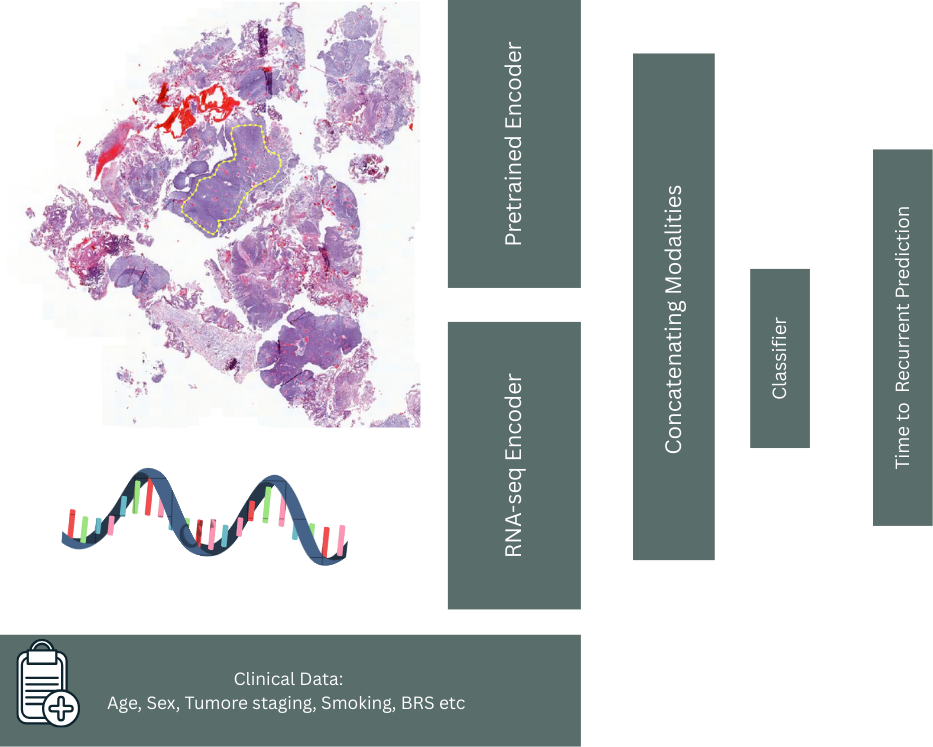

# Multimodal Framework for Federated Learning (MuFFLe)

## TODO List + References:
- [X] Reference previous years' repos as inspo for this GitHub repo
  - [GeneVar2](https://github.com/collaborativebioinformatics/GeneVar2), a little *too* good because it was a 2nd followup project
  - [Haploblock Clusters](https://github.com/collaborativebioinformatics/Haploblock_Clusters_ElixirBH25)
- [X] Stick w the default MIT License, just don't use GPL or LGPL because industry can't use it 
- [ ] (Tyler) Implement the baseline for Task 3 of Chimera in a federated setting (NVFlare)
- [ ] Use Chimera Task 3 leaderboard and other research to think about improvements or a potential way to use a federated model to do well on this task
- [ ] Now that we're in a federated setting, we can do updates for each modality independently, and thus we can extend each modality's data beyond the data merely provided in CHIMERA
  - [ ] e.g., find more histopathology data
  - [ ] e.g., find other potential modalities that might bolster our global fusion model (or we update our different fusion model architecture to take in this extra modality).
  - [ ] could explore PCA or some other method that just takes in generic embeddings, and thus our fusion model could take in as many different modalities as we want, and the embeddings just have their semantic meaning (this may be out of scope for the hackathon)


# Quick Start
```bash
# create a Python virtual environment (I used .venv, use conda or wtv you want)
source .venv/bin/activate # or however you activate your Python virtual environments.
pip install nvflare
# Install PyTorch optional dependencies
pip install "nvflare[PT]" # should also install torch and other necessary packages
pip install tensorboard matplotlib
pip install jupyter ipykernel
```

- [ ] 

# Directory Structure
- [ ] Generate with Tree

# Introduction (1 para)

# Methods (2 paras)

## Example Dataset and Task
We decided to go with the data for the [CHIMERA Challenge](https://registry.opendata.aws/chimera), which stands for
> Combining HIstology, Medical imaging (radiology) and molEcular data for medical pRognosis and diAgnosis
Details for the challenge are [here](https://chimera.grand-challenge.org/).

*author's note, what a forced acronym :-)*

This data was open-access and easily available on [AWS Open Data](https://registry.opendata.aws/). 

We opted for [Task 3](https://chimera.grand-challenge.org/task-3-bladder-cancer-recurrence-prediction/) of this challenge. See [How we built this tool](#how-to-use-this-tool) for the reasons why we chose this task.

## Setting up the baseline
The [CHIMERA repository](https://github.com/DIAGNijmegen/CHIMERA/tree/main) does not give great instructions for how to establish the task 3 baseline. *The README in that folder is 1 byte. As in it's blank. Disgusting.* So we cloned the repository locally and recreated it ourselves. 

During development, we realized that the CHIMERA challenge ran for 4 months
>📢 Challenge Announcement & Registration Opens – April 10, 2025

>Training Data Release – April 10, 2025

>Validation Phase Begins – June 1, 2025 June 13, 2025

>Test Set Submission Deadline – August 1, 2025 August 22 AOE, 2025

To decrease the scope of what we had to do and make it feasible for the hackathon, we threw out the image features and only developed on the RNA and clinical data inputs as a proof-of-concept.

## Extending the Challenge
(PROPOSED, NOT GUARANTEED YET) Because we have now implemented this in a federated setting, we can now extend each subtype of data provided in CHIMERA using other open-access datasets. (I'm just freestyling rn) For example, the histopathology data was extended with SOME DATASET HERE


# How we built this tool
We started by brainstorming potential ways to integrate multimodal data. We considered natively multimodal models, like Vision Transformers (ViT), but we opted not to do such a thing for several considerations:
1. Cost: fine-tuning large ViTs, even open-source ones such as [Qwen-3 VL](https://github.com/QwenLM/Qwen3-VL) is computationally expensive 
2. Catastrophic forgetting: similar to how RL updates may undo themselves over time, updates from different modalities might "cancel out" and lead to more confusion than actually meaningful results. 

As a result, we opted for an approach that better leverages smaller, more specialized models. This led us to the diagram below:


Which naturally lent itself to the very similar diagram from [CHIMERA, task 3](https://chimera.grand-challenge.org/task-3-bladder-cancer-recurrence-prediction/). **(Half serious) we want to emphasize that we dreamt up the diagram above before running into CHIMERA.**


# How to use this tool

# Future Directions
There are some low-hanging fruit that this could be applied to. While searching for instances to create our proof-of-concept, we came across some data from the Real-time Analysis and Discovery in Integrated And Networked Technologies (RADIANT) group, which 
> seeks to develop an extensible, federated framework for rapid exchange of multimodal clinical and research data on behalf of accelerated discovery and patient impact. 
[RADIANT Public Data (AWS)](https://registry.opendata.aws/radiant/)

We elected not to use this dataset because the S3 bucket had "controlled access," which required filling out a form for approval and did not fit the fast-paced nature of the Hackathon. However, our federated learning framework could be easily extended to RADIANT's data, which contains
> Clinical data, Imaging data, Histology data, Genomic data, Proteomics data, and more [Children's Brain Tumor Network (CBTN)](https://cbtn.org/research-resources)

# References (BibTeX)